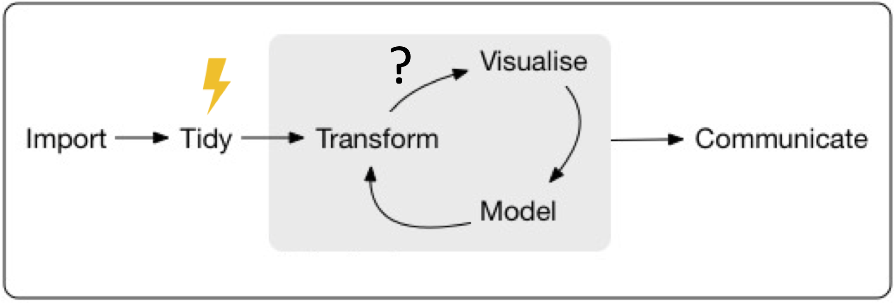

```{r setup, include=FALSE}
knitr::opts_chunk$set(echo = FALSE)
library(targets)
library(tarchetypes)
library(xaringanthemer)
style_mono_accent(
  base_color = "#006682",
  text_font_size = "1.2rem",
  extra_css = list(
    ".small" = list("font-size" = "60%")
  ))
```

## Introduction to {targets} for effective workflows in R

**Joel Nitta**

AsiaR Meetup <span style = 'font-size: 120%;'>2022/05/07</span>

<br><br>

<br><br><br>https://joelnitta.github.io/asiaR-targets-intro

---

## Self-introduction

.pull-left[
@joel_nitta

https://joelnitta.com

- Project Research Associate @ [Tokyo University](http://iwasakilab.k.u-tokyo.ac.jp/)

- Research interests: Ecology and evolution of __ferns__

- Hobbies: Running (after my 6YO!)
]

.pull-right[

.small[Photo: J-Y Meyer]
]

---
## Outline of today's talk

- Introduction to {targets}

- Live coding

To follow along with live coding, install [R](https://www.r-project.org/), [RStudio](https://www.rstudio.com/products/rstudio/download/), and [targets](https://github.com/ropensci/targets)

---
## Why {targets}?

--

### To make your code more reproducible

---
## What is reproducibility?

--

> The ability for others (or your future self) to re-run your code and get the same results

--

- Not "yes" or "no"
- Reproducibility = **mindset**
- Many aspects
  - Computing environment
  - Data availability
  - **Code automation**
  
---
## Workflows in R


**Which steps** need to be run **in what order**?

.footnote[R for Data Science https://r4ds.had.co.nz/]

---
## Workflows in R



If **one part** of a workflow changes, **how does it affect other parts?**

**How much of it do we need to re-run?**

---

## What is {targets}?

.pull-left[
- Automates workflow

- Only runs necessary steps

- Can run workflow steps in parallel (speeds up analysis)

- Provides proof that **results** are derived **from code**
]


---
## Resources

- Github https://github.com/ropensci/targets

- Package website https://docs.ropensci.org/targets/

- User manual https://books.ropensci.org/targets/

- Targetopia https://wlandau.github.io/targetopia/

- {tarchetypes} website https://docs.ropensci.org/tarchetypes/

- Discussion board https://github.com/ropensci/targets/discussions

---
## Live Coding

- `tar_script()`: Write a generic workflow script

- `tar_visnetwork()`: Visualize the state of the workflow

- `tar_make()`: Run the workflow

- `tar_load()`: Load a target from the workflow

- `tar_outdated()`： List which steps will be run next time

---
class: inverse, center, middle

# Live Coding

---
## Example workflows

- Gapminder workflow

  - https://github.com/joelnitta/targets_gapminder_example

- Variant calling workflow

  - https://github.com/joelnitta/targets_vcf_example

- My projects on github

  - https://github.com/joelnitta/#reproducible-data-analysis-

---
## Summary

- Write your workflow plan in `_targets.R`

- Run your workflow with `tar_make()`

- Check the status of your workflow with `tar_visnetwork()`

---
## If you want to learn more...

User manual https://books.ropensci.org/targets/


---
class: inverse, center, middle

# Thank you!
